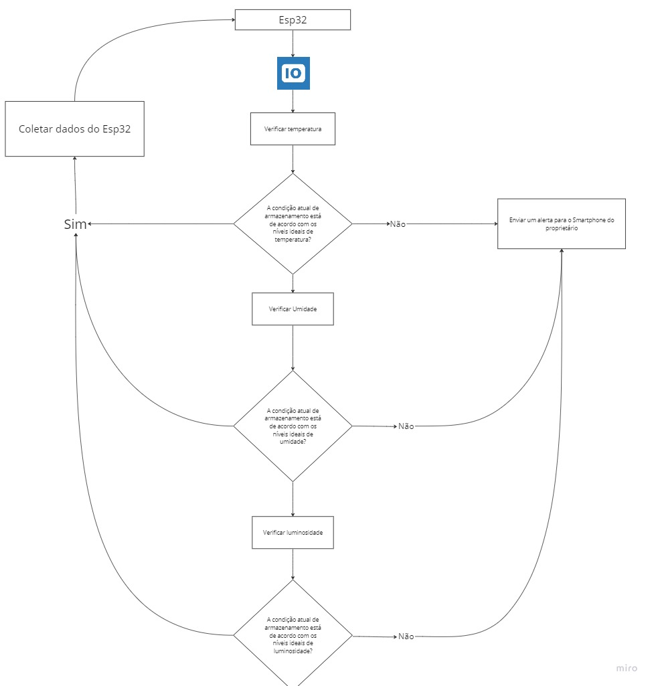

# Checkpoint 4 - O Caso da VinheriaAgnello

**Nome dos participantes:**

- Guilherme Silva Dos Santos
- Kayque Moraes Dias
- Laís Granero Bertoncello
- Wesley de Souza Silva
- Samuel Ramos de Almeida

**Turma:** 1º ESPX

**Ano:** 2023
___

## 1º Descrição do desafio

Fomos contratados pela Vinheria Agnello para desenvolver um sistema de monitoramento a ser instalado no ambiente em que os vinhos são armazenados. O dono a Vinheria informou que a qualidade do vinho é influenciada diretamente pelas condições de temperatura, umidade e luminosidade do ambiente. No primeiro momento, você propôs ao dono da Vinheria um projeto em etapas, de modo que seu 1° desafio foi:

   - Elaborar um sistema usando Arduino que faça a captura das informações de luminosidade do ambiente. Para isso pesquise sobre o LDR. Verifique como eles funcionam e como poderiam ser usados no projeto.

   - Depois dos dados coletados, implemente um sistema de alarme, utilizando LEDs, para sinalizar quando o a ambiente estiver OK, ou quando alguma grandeza estiver fora dos limites estipulados. Use um LED verde para indicar que está OK, um LED amarelo para indica que está em níveis de alerta e um LED Vermelho para indicar que tem algum problema.

   - Quando a luminosidade estiver em nível de alerta, deve soar uma buzina (buzzer) por 3 segundos. A buzina volta a soar caso a luminosidade permaneça em nível de alerta.

Vocês apresentaram a 1º parte do projeto para os proprietários da Vinheria e eles ficaram
muito satisfeitos com o resultado, porém, eles fizeram vários questionamentos em relação a
apresentação:

“ Isso é mais legal que o anterior, porém eu preciso vir até aqui para ver o que está acontencedo...
Seria melhor se vocês mandassem essas mensagens para o meu computador!”

Diante dessa conversa, vocês precisam passar para a fase três do projeto para atender a esses
novos requisitos:

- Vocês devem pegar os dados dos sensores de Luminosidade, Temperatura e Umidade e envialos a cada 5 segundos para um servidor;

- Inicialmente, devem mostras esses dados em um gráfico de linha para o proprietário ter uma
ideia de histórico.

___

## Desenvolvimento do projeto

Após concluir a primeira etapa do desafio, recebemos feedback para aprimoramento. Nessa fase, já dominamos a coleta de dados físicos da adega, mas agora enfrentamos o desafio de enviá-los para a internet. Nesse sentido, optamos por utilizar a placa ESP32 para tornar nosso projeto capaz de se comunicar online com outros dispositivos.

A principal dificuldade do projeto foi compreender como enviar os dados do nosso dispositivo para a internet. Para isso, foi necessário utilizar o protocolo HTTP (Protocolo de Transferência de Hipertexto) como meio de transmissão de dados.

O passo crucial para resolver esse desafio foi criar uma função que envia todos os dados para uma plataforma de IoT (Internet das Coisas). Para esse fim, escolhemos a plataforma tago.io. Desenvolvemos um painel dinâmico que exibe informações como temperatura, luminosidade e umidade. Além disso, como complemento, criamos uma função que verifica se os valores recebidos são ideais para o armazenamento de vinhos. Caso os valores estejam fora do padrão, a plataforma emitirá uma mensagem para os proprietários da Vinheria, alertando sobre a situação.

___
   
## Pré-requisitos

Para utilizar este projeto, você precisará de:

   #### HARDWARE  

   - ESP32
   - Cabo de dados e carga - Micro USB
   - LDR 
   - 1 resistor de 220 ohm
   - 1 resistor de 1k ohm
   - Protoboard 830 Pontos
   - 6 jumpers

   #### SOFTWARE 

   - Arduino IDE

   
___
## Como executar o projeto

Após a instalação do Arduíno IDE, você deve seguir os seguintes passos:

1. Faça download do código da pasta "Código Fonte" deste repositório.
2. Abra o código no Arduino IDE.
4. Faça o download da biblioteca ESP32
3. Conecte os sensores e componentes de acordo com as instruções fornecidas no código.

____

## Modelo lógico  

## Video Explicativo
Link do vídeo: https://drive.google.com/file/d/1z9HDu9Qwvj4LR8yPAYfAkxCH0zUB2N9J/view?usp=sharing

